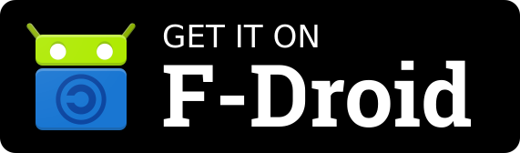

<!-- {{{1

    File        : README.md
    Maintainer  : FC Stegerman <flx@obfusk.net>
    Date        : 2021-07-12

    Copyright   : Copyright (C) 2021  FC Stegerman
    Version     : v0.2.5
    License     : AGPLv3+

}}}1 -->

## Description

sokobang - sokoban puzzle w/ bigbang.coffee

→ https://sokobang.obfusk.dev

Sokoban(g) is a sokoban puzzle -- with images and levels from
[ksokoban](https://projects.kde.org/projects/playground/games/ksokoban/repository)
-- written in coffeescript using the
[bigbang.coffee](https://github.com/obfusk/bigbang.coffee) library.

## Dependencies

To run the game, you will need bigbang.coffee; when using git, use
`git submodule update --init` to fetch and use the dependencies.

## TODO

* further optimize drawing?
* reload level?
* improve render_end?
* improve state handling in start.coffee?
* specs/docs?
* ...

## License

### Code

© FC Stegerman

### Images & Levels

See [`README.ksokoban`](README.ksokoban).

### Person Image

© Google Inc.

[Apache 2.0](https://github.com/googlefonts/noto-emoji/blob/master/LICENSE)

NB: `person.png` is an unmodified render of the original SVG;
`person_goal.png` is a combination of `person.png` and `goal.png` (and
thus licensed under AGPLv3+).

<!-- vim: set tw=70 sw=2 sts=2 et fdm=marker : -->
